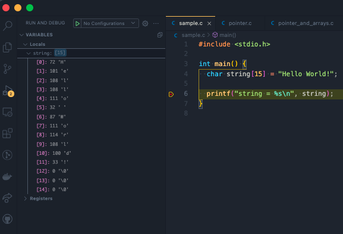

## 目次

<!-- TOC -->

- [目次](#目次)
- [関連リンク](#関連リンク)
- [C言語における配列](#c言語における配列)
  - [宣言と初期化](#宣言と初期化)
  - [データサイズを指定せずに初期化](#データサイズを指定せずに初期化)
  - [C言語に空の配列は存在しない](#c言語に空の配列は存在しない)
- [配列要素へのアクセス](#配列要素へのアクセス)
- [配列要素への設定](#配列要素への設定)
- [二次元配列](#二次元配列)
- [配列のメモリサイズを調べる](#配列のメモリサイズを調べる)
  - [sizeof演算子を利用して調べる](#sizeof演算子を利用して調べる)
- [配列の要素数を調べるには？](#配列の要素数を調べるには)
- [配列の最後の要素を取得するには？](#配列の最後の要素を取得するには)
  - [配列の要素数から導く](#配列の要素数から導く)
  - [sizeofの補足](#sizeofの補足)
- [文字列とは文字の配列](#文字列とは文字の配列)
  - [文字の配列の残りの要素](#文字の配列の残りの要素)
  - [文字列の長さを調べる](#文字列の長さを調べる)
  - [stdlib.hの文字列関数](#stdlibhの文字列関数)
  - [string.hの文字列関数](#stringhの文字列関数)

<!-- /TOC -->

---

## 関連リンク

[C言語入門リスト](https://heuristic-bartik-0f9dae.netlify.app/blog/c-list)

---

## C言語における配列

C言語でいう配列とは同じデータ型のデータ群を格納するためのデータ構造です。

ここで注意が必要なのが異なるデータ型を混在させることができないという点です。

さらに配列は、連続したメモリの位置に格納され、宣言後にサイズを変更することはできません。

### 宣言と初期化

変数宣言と、初期化の例です。

```c
int numbers[10] = {1, 2, 3, 4, 5, 6, 7, 8, 9, 10}; // 要素が10個あるsizeが10の配列
```

ちなみに、sizeで要素数が決まりますが、要素が少なかった場合は残りの要素は0になる。

以下の例では、配列番号0 ~ 4に左から値が割り振られていき、`残りの5 ~ 9には 0 が格納される` 様になる。

```c
int numbers[10] = {1, 2, 3, 4, 5}; // sizeが10の配列
```


### データサイズを指定せずに初期化

初期化時に型と要素数に応じて自動でデータサイズが決まります。

```c
int numbers[] = {1, 2, 3, 4, 5, 6, 7, 8, 9, 10};
```

size指定なしで配列を定義するのはエラーになります。

```c
int numbers[]; // これはダメ
// error: definition of variable with array type needs an explicit size or an initializer
```

### C言語に空の配列は存在しない

C言語では言語レベルで空の配列というものは存在しません。

空の配列を定義するとエラーになる。

```c
#include <stdio.h>

int main() {
  // int int_array1[]; 空の定義はNG
  int int_array2[3]; // サイズ指定の定義はOK
  int int_array3[] = {1, 2, 3, 4, 5}; // 初期化時にサイズを自動で決めるのはOK

  // char string_array1[]; 空の定義はNG
  char string_array2[3]; // サイズ指定の定義はOK
  char string_array3[] = "Hello, World"; // 初期化時にサイズを自動で決めるのはOK
  char string_array4[] = {'H', 'e', 'l', 'l', 'o', 'W', 'o', 'r', 'l', 'd'};
}
```

[C言語における配列](#C言語における配列) で確認した通り数値の配列が10要素格納できる配列に5つだけ要素を指定した場合、残りの5つは `0` が格納されていました。

他の言語では空の配列という概念がありますが、Cには無いので注意！

## 配列要素へのアクセス

```c
int numbers[10] = {1, 2, 3, 4, 5, 6, 7, 8, 9, 10}; // sizeが10の配列

// RubyやPythonである様な -1 で最後の要素を取得するというのは無理
numbers[0] // 1
numbers[1] // 2
numbers[2] // 3
...
```

## 配列要素への設定

要素の値を再度設定することも可能です。

```c
#include <stdio.h>

int main() {
  int numbers[10] = {1, 2, 3, 4, 5};

  numbers[0] = 100;
  printf("%d", numbers[0]);

  return 0;
}
```

```
100
```

## 二次元配列

初期化は以下の様にできます。
```c
int x[3][5] = {
  {1,2,3,4,5},
  {6,7,8,9,10},
  {11,12,13,14,15}
};

printf("%d\n", x[0][0]); // 1
x[0][0] = 100
printf("%d\n", x[0][0]); // 100
```

もちろん二次元以上の多重配列も扱えます。

```c
int x[3][3][3] = {
  {{1,2,3}, {4,5,6}, {7,8,9}},
  {{1,2,3}, {4,5,6}, {7,8,9}},
  {{1,2,3}, {4,5,6}, {7,8,9}},
};
```

## 配列のメモリサイズを調べる

### sizeof演算子を利用して調べる
sizeofの引数に型名か変数や定数や式などを渡すとその型のデータがメモリを占めるバイト数を教えてくれます。

- sizeof(型)
- sizeof(変数など)

以下の配列がどれほどのメモリが必要になるのかを調べてみました。

int型で要素が5つあるケースです。

```c
#include <stdio.h>

int main() {
  int numbers[5] = { 11, 2, 33, 4, 55 };

  printf("int型を１つ保持するには %lu byte必要\n", sizeof(int));
  printf("今回の配列全体を保持するために %lu byte必要\n", sizeof(numbers));
  printf("以下は配列の各要素のメモリサイズ")
  printf("%lu byte\n", sizeof(numbers[0]));
  printf("%lu byte\n", sizeof(numbers[1]));
  printf("%lu byte\n", sizeof(numbers[2]));
  printf("%lu byte\n", sizeof(numbers[3]));
  printf("%lu byte\n", sizeof(numbers[4]));
}
```

```
int型を１つ保持するには 4 byte必要
今回の配列全体を保持するために 20 byte必要
以下は配列の各要素のメモリサイズ
4 byte
4 byte
4 byte
4 byte
4 byte
```

`配列の各要素のデータサイズは同じなんですねぇ〜😲`

つまり配列のサイズは `要素の型のサイズ * 要素数` とも解釈できますね！😀

## 配列の要素数を調べるには？

[配列のメモリサイズを調べる](#配列のメモリサイズを調べる) で配列の各要素のメモリサイズは同じということが分かりました。

なので配列の要素数は、`配列全体サイズ` から、`要素一つ分サイズ` がいくつあるか調べればよいということになります。

`全体サイズ / 要素一つ分サイズ` 算出できますねぇ〜

[C言語にからの配列は存在しない](#C言語に空の配列は存在しない)で説明した様に、配列が初期化されてるなら0番目には必ず何かしら値があるので 0 としています。

```c
sizeof(配列) / sizeof(配列[0]);
```

```c
#include <stdio.h>

int main() {
  int numbers[5] = { 11, 2, 33, 4, 55 };
  int length = sizeof(numbers) / sizeof(numbers[0]);
  printf("配列の要素数: %d", length);
}
```

```
配列の要素数: 5
```

## 配列の最後の要素を取得するには？

### 配列の要素数から導く

[配列の要素数を調べるには？](#配列の要素数を調べるには？) で説明した様に配列の要素数は `sizeof(配列) / sizeof(配列[0])` で取得できました。

要素数 N個 の配列はそれぞれの要素の番号は `0 ... N-1` なので
 `配列の要素数-1` 番目が最後の要素になります。

```c
#include <stdio.h>

int main() {
  int numbers[5] = { 11, 2, 33, 4, 55 };
  int length = sizeof(numbers) / sizeof(numbers[0]);
  int last_element = numbers[sizeof(numbers) / sizeof(numbers[0]) - 1];
  printf("配列の要素数: %d\n", length);
  printf("配列の最後の要素: %d\n", last_element);
}
```

```
配列の要素数: 5
配列の最後の要素: 55
```

ちなみに 配列の最初の要素は `*(配列)` でも取得できます。(括弧は省略可能)、

配列名は配列の最初の要素のポインタとして振る舞うということになります。

これについては次の記事で詳しく説明していきます。

以下の様にしても配列の要素数を取得したり、最後の要素を取得したりできます。

```c
int numbers[5] = { 11, 2, 33, 4, 55 };

// 配列の要素の個数
sizeof(numbers) / sizeof(*(numbers))

// 配列の最後の要素
numbers[sizeof(numbers) / sizeof(*(numbers)) -1]
```

### sizeofの補足
sizeofの結果のデータ型は符号無し整数型 `size_t` になる。
intやunsigned intではない。
変数に格納する場合は `size_t` を使うのがよい。
size_tは処理系に定義されているらしい。

```c
int numbers[5] = { 11, 2, 33, 4, 55 };
size_t size = sizeof(numbers)
```

## 文字列とは文字の配列

C言語入門記事のpart1でも紹介していますが、C言語では文字列とは文字の配列のことです。

```c
#include <stdio.h>

int main() {
  char string1[4] = { 'a', 'b', 'c', '\0' }; // どこで終わりにするかを '\0' で表す必要がある。
  char string2[] = "Hello World!"; // 0 ~ 11には右辺の各文字が格納されており、12個目の文字には要素の終わりを表す '\0' が実は入っている.
  char string3[6]; // 最大6文字まで入る文字列(= 最後に'\0'が入るので5文字指定できる)

  printf("string1 = %s\n", string1);
  printf("string2 = %s\n", string2);
}
```

```
string1 = abc
string2 = Hello World!
```

文字の配列が文字列になっている🤔

### 文字の配列の残りの要素

宣言したサイズが15であり(0 ~ 14)、"Hello World!"を格納した時には残りの 12 ~ 14番目の要素には '\0' が格納されています。

```c
#include <stdio.h>

int main() {
  char string[15] = "Hello World!";

  printf("string = %s\n", string);
}
```



### 文字列の長さを調べる

string.h で定義されているstrlen関数を利用します。

```c
#include <stdio.h>
#include <string.h> // 標準の文字列を扱う関数を使う場合は宣言

int main() {
  char string[15] = "Hello World!";
  int str_length;
  str_length = strlen(string);

  printf("string = %s\n", string);

  // 文字の数(スペースも含む) '\0' はカウントされない。
  printf("str_length is %d\n", str_length);
}
```

```
string = Hello World!
str_length is 12
```

文字列の最後の文字を取得するには `strlen() - 1` 番目の要素を取得すればよいですかね。(あまりそういうケースはないと思いますが。。。)

他にも様々な関数が用意されています。

### stdlib.hの文字列関数

|関数|意味|
|---|---|
|int atoi(文字列)|ASCII to integerを意味する。文字列をint型に変換する。最初の文字が数値出ない場合または、数字が無い場合は0を返却します。|
|double atof(文字列)|ASCII to floatを意味する。文字列をfloat型の値に変換する。最初の文字が数値出ない場合または、数字が無い場合は0.0を返却します。|
|long int atol(文字列)|ASCII to long int.文字列をlong intege型の値に変換する。最初の文字が数値出ない場合または、数字が無い場合は0を返却します。|

atoi() lacks error handling

it is recommended to use strtol() if you want to make sure that proper error handling is done.

### string.hの文字列関数

- string.h に定義されている様々な関数。

|関数|意味|
|---|---|
|strlen()|文字列の長さを調べる|
|strcat()|2つの文字列を統合する|
|strcpy()|文字列をコピーする|
|strlwr()|lower caseに変換|
|strupr()|upper caseに変換|
|strrev()|文字列の並びを反転させる|
|strcmp()|文字列を比較する|

などなど様々ありますね😀
