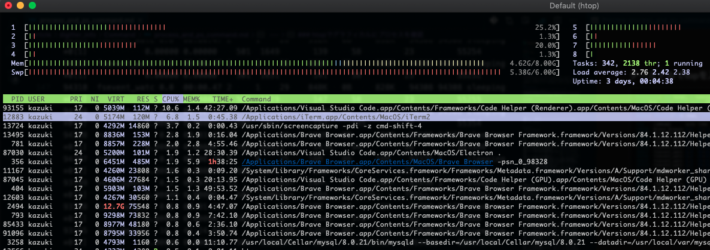

<!-- prerender: true -->
<!-- class: invert -->

<style>
section {
  font-size: 20px
}
</style>

# プロセス

- 1: プロセスの概要

- 2: ps プロセスを確認する

- 3: top, htop リアルタイムでプロセスを確認

---

## 1. プロセスの概要

---

### プロセスとは
>実行中の処理、プログラム

Railsのサーバーを起動すること👩‍💻 SQLサーバーを起動することなども一つのプロセス👨‍💻

一つのプログラム起動時に、複数のプラグラムを起動することもあるので、多くのプロセスが実は実行されていたりする。

ちなみに、プロセスはコンピューターのメモリを消費し、プロセスが終われば基本的にメモリは解放されます。

***

### デーモンプロセス😈

>メモリに常駐していて、特定の処理をしてくれるバックグラウンドプロセス。

自律的に特定の処理を実行したりする。
ネットワークからの要求を処理する時や、日時を決めて自動で実行したい処理を行う際にも利用されています。
もし強制的にプロセスを止めたいなら、killコマンドを使ったりします。

デーモンの由来
>UNIX/Linuxでよく使われる「Daemon」(デーモン)プロセスの語源とは？ - GIGAZINE
>https://gigazine.net/news/20180206-unix-linux-daemon/

---

## 2. ps プロセスを確認する

---

### 基本

>ターミナルでpsを実行

```
❯ ps
  PID TTY           TIME CMD
59622 ttys000    0:00.06 /Applications/iTerm.app/Contents/MacOS/iTerm2 --server login -fp kazuki
59627 ttys000    0:00.66 -zsh
```

---

### オプション

- psで利用するオプションの例

>a: 端末を持つプロセスを表示
>u: プロセスの詳細を表示
>x: 端末を持たないプロセスを表示

```
❯ ps aux
USER               PID  %CPU %MEM      VSZ    RSS   TT  STAT STARTED      TIME COMMAND
kazuki           59620  13.6  3.7  5549548 311664   ??  S     9:14PM   1:44.79 /Applications/iTerm.app/Contents/MacOS/iTerm2
kazuki           87685  11.2  1.3  5106288 111608   ??  S     9:58PM   4:44.67 /Applications/Visual Studio Code.app/Contents/Frameworks/Code Helper (Renderer).app/Contents/MacOS
_windowserver      151   7.5  0.5  7556852  38904   ??  Ss   土12AM 126:36.40 /System/Library/PrivateFrameworks/SkyLight.framework/Resources/WindowServer -daemon
kazuki           87030   4.4  1.5  5226392 124680   ??  Us    9:39PM   4:53.45 /Applications/Visual Studio Code.app/Contents/MacOS/Electron .
kazuki             356   3.9  4.9  6339088 409492   ??  S    土12AM  65:56.79 /Applications/Brave Browser.app/Contents/MacOS/Brave Browser -psn_0_98328
_hidd               99   2.6  0.1  4382424   5052   ??  Ss   土12AM  21:55.82 /usr/libexec/hidd
kazuki             374   2.4  0.5  5294876  39812   ??  U    土12AM   1:22.78 /System/Library/CoreServices/Finder.app/Contents/MacOS/Finder
kazuki           87045   1.6  0.6  4839140  48540   ??  S     9:39PM   2:46.29 /Applications/Visual Studio Code.app/Contents/Frameworks/Code Helper (GPU).app/Contents/MacOS/Code
kazuki           58501   1.4  1.4  5667960 118124   ??  Ss    6:00PM   1:48.72 /System/Library/Input Methods/JapaneseIM.app/Contents/PlugIns/JapaneseIM.appex/Contents/MacOS/Japa
kazuki             369   0.7  1.8  5108984 152652   ??  S    土12AM   8:27.09 /Applications/Google Chrome.app/Contents/MacOS/Google Chrome -psn_0_122910
kazuki           59339   0.6  0.4  4411004  30204   ??  R     9:05PM   0:11.16 /System/Library/CoreServices/Siri.app/Contents/MacOS/Siri launchd
kazuki           59627   0.6  0.0  4336076   4004 s000  S     9:14PM   0:00.67 -zsh
kazuki            3258   0.3  0.0  4908472   1888   ??  S    土12PM   7:26.90 /usr/local/Cellar/mysql/8.0.21/bin/mysqld --basedir=/usr/local/Cellar/mysql/8.0.21 --datadir=/usr/

.
.
.
```

---

### psの見方

|項目|説明|
|-|-|
|USER|実行しているユーザ名|
|PID|プロセスに割り振られた識別番号つまりプロセスID|
%CPU|CPUの使用率|
%MEM|メモリ使用率|
VSZ|プロセスが確保しいる仮想メモリサイズ|
RSS|実際に使用されているメモリ量|
TTY(TT)|端末名|
STAT|プロセスの状態を表示|
START|コマンドが起動した時刻|
TIME|プロセスが実行された総実行時間|
COMMAND|コマンド名|

---

## 3. top, htop リアルタイムでプロセスを確認

---

### ターミナルでtopを入力

```
Processes: 338 total, 2 running, 336 sleeping, 2627 threads                                                                                                                        00:05:41
Load Avg: 1.56, 2.37, 2.44  CPU usage: 4.23% user, 2.70% sys, 93.6% idle   SharedLibs: 143M resident, 48M data, 27M linkedit.
MemRegions: 293205 total, 2264M resident, 67M private, 621M shared. PhysMem: 7797M used (2413M wired), 393M unused.
VM: 1964G vsize, 1372M framework vsize, 126052743(64) swapins, 128508155(0) swapouts.  Networks: packets: 7484144/3308M in, 12556207/3420M out.
Disks: 9561391/556G read, 5399200/519G written.

PID    COMMAND      %CPU TIME     #TH   #WQ  #PORT MEM    PURG   CMPRS  PGRP  PPID  STATE    BOOSTS           %CPU_ME %CPU_OTHRS UID  FAULTS     COW     MSGSENT    MSGRECV    SYSBSD
99950  Brave Browse 0.0  14:11.51 15    1    144   83M    0B     81M    356   356   sleeping *0[5]            0.00000 0.00000    501  416917     2438    2216324    359119     1535114
99949  Brave Browse 0.2  05:45.56 22    2    297   341M+  0B     306M-  356   356   sleeping *0[6]            0.00000 0.00000    501  4120035+   9151    652221+    435369+    4969516+
94320  fsevent_watc 0.0  00:00.46 2     1    29    912K   0B     892K   94308 94308 sleeping *0[1]            0.00000 0.00000    501  1666       150     58         23         55257
94319  fsevent_watc 0.0  00:00.46 2     1    26    904K   0B     884K   94308 94308 sleeping *0[1]            0.00000 0.00000    501  1646       145     58         23         55254
94318  fsevent_watc 0.0  00:00.46 2     1    29    900K   0B     880K   94308 94308 sleeping *0[1]            0.00000 0.00000    501  1638       139     58         23         55255
94317  fsevent_watc 0.0  00:00.49 2     1    29    888K   0B     868K   94308 94308 sleeping *0[1]            0.00000 0.00000    501  1645       143     58         23         55255
94316  fsevent_watc 0.0  00:00.47 2     1    26    908K   0B     888K   94308 94308 sleeping *0[1]            0.00000 0.00000    501  1643       149     58         23         55254
94315  fsevent_watc 0.0  00:00.48 2     1    26    872K   0B     852K   94308 94308 sleeping *0[1]            0.00000 0.00000    501  1648       150     58         23         55254
94314  fsevent_watc 0.0  00:00.46 2     1    26    896K   0B     876K   94308 94308 sleeping *0[1]            0.00000 0.00000    501  1654       144     58         23         55254
94313  fsevent_watc 0.0  00:00.47 2     1    26    912K   0B     892K   94308 94308 sleeping *0[1]            0.00000 0.00000    501  1649       139     58         23         55254
94312  fsevent_watc 0.0  00:00.47 2     1    26    860K   0B     840K   94308 94308 sleeping *0[1]            0.00000 0.00000    501  1651       141     58         23         55252
94310  fsevent_watc 0.0  00:00.47 2     1    29    848K   0B     828K   94308 94308 sleeping *0[1]            0.00000 0.00000    501  1629       147     58         23         55255
94309  fsevent_watc 0.0  00:00.53 2     1    29    1136K  0B     1116K  94308 94308 sleeping *0[1]            0.00000 0.00000    501  2067       153     145        27         55354
94308  ruby         0.0  00:03.89 18    0    49    101M   0B     100M   94308 94307 sleeping *0[1]            0.00000 0.00000    501  84923      1414    94         28         363346
94307  ruby         0.0  00:00.49 5     0    25    16M    0B     16M    92371 1     sleeping *0[1]            0.00000 0.00000    501  9141       282     60         22         43901
93199  vsls-agent   0.2  00:07.14 13    1    63-   28M-   0B     24M-   87030 1     sleeping *0[1]            0.00000 0.00000    501  100581+    489     15186+     7565+      117331+
93158  Code Helper  0.0  00:01.20 15    1    77    18M    0B     15M    87030 93137 sleeping *0[1]            0.00000 0.00000    501  23428      1341    378        105        16088
93155  Code Helper  10.2 41:24.69 20    1    199   125M+  0B     79M    87030 87030 sleeping *0[1]            0.00000 0.00000    501  530887+    2503    21961163+  5869892+   12014349+
93147  Code Helper  0.0  00:01.41 10    1    63    16M    0B     11M    87030 93138 sleeping *0[1]            0.00000 0.00000    501  20966      1335    192        95         22963+
```

---

### htopでグラフィカルにプロセスを確認
>htopをインストールしてターミナルでhtopと入力

<!--  -->


```
  1  [|||||||||||||||||||||||||||                                                                                              21.1%]   5  [||||||||||||||||||                                                                                                       13.8%]
  2  [||                                                                                                                        1.3%]   6  [|                                                                                                                         0.7%]
  3  [||||||||||||||||||||                                                                                                     15.2%]   7  [|||||||||||||                                                                                                             9.3%]
  4  [||                                                                                                                        1.3%]   8  [|                                                                                                                         0.7%]
  Mem[|||||||||||||||||||||||||||||||||||||||||||||||||||||||||||||||||||||||||||||||||||||||||||||||||||||||||||||      4.58G/8.00G]   Tasks: 377, 2212 thr; 1 running
  Swp[|||||||||||||||||||||||||||||||||||||||||||||||||||||||||||||||||||||||||||||||||||||||||||||||||||||||||||||||||||5.44G/6.00G]   Load average: 2.50 2.15 2.05
                                                                                                                                        Uptime: 3 days, 00:33:02

  PID USER      PRI  NI  VIRT   RES S CPU% MEM%   TIME+  Command
12883 kazuki     17   0 5176M  120M ? 11.0  1.5  0:52.14 /Applications/iTerm.app/Contents/MacOS/iTerm2
93155 kazuki     17   0 5003M 84008 ? 11.3  1.0 45:36.39 /Applications/Visual Studio Code.app/Contents/Frameworks/Code Helper (Renderer).app/Contents/MacOS/Code Helper (Renderer) --type=renderer --disable-color-correct-rendering --field-trial-handle=1718379636,17968415697
13992 kazuki     17   0 9011M  136M ?  6.7  1.7  0:14.24 /Applications/Brave Browser.app/Contents/Frameworks/Brave Browser Framework.framework/Versions/84.1.12.112/Helpers/Brave Browser Helper (Renderer).app/Contents/MacOS/Brave Browser Helper (Renderer) --type=renderer -
  356 kazuki      8   0 6472M  449M ?  1.7  5.5  1h39:35 /Applications/Brave Browser.app/Contents/MacOS/Brave Browser -psn_0_98328
87030 kazuki     24   0 5193M  109M ?  2.1  1.3 29:31.22 /Applications/Visual Studio Code.app/Contents/MacOS/Electron .
  404 kazuki     17   0 5840M  129M ?  1.8  1.6 50:21.45 /Applications/Brave Browser.app/Contents/Frameworks/Brave Browser Framework.framework/Versions/84.1.12.112/Helpers/Brave Browser Helper (GPU).app/Contents/MacOS/Brave Browser Helper (GPU) --type=gpu-process --field-
87045 kazuki     17   0 4618M 24428 ?  1.7  0.3 21:00.71 /Applications/Visual Studio Code.app/Contents/Frameworks/Code Helper (GPU).app/Contents/MacOS/Code Helper (GPU) --type=gpu-process --field-trial-handle=1718379636,17968415697906329051,6474983435502091724,131072 --di
  789 kazuki     17   0 12.9G 43436 ?  0.1  0.5  1:51.35 /Applications/Google Chrome.app/Contents/Frameworks/Google Chrome Framework.framework/Versions/85.0.4183.83/Helpers/Google Chrome Helper (Renderer).app/Contents/MacOS/Google Chrome Helper (Renderer) --type=renderer
 4967 kazuki     17   0 4568M 54952 ?  0.4  0.7  2:09.17 /Applications/Brave Browser.app/Contents/Frameworks/Brave Browser Framework.framework/Versions/84.1.12.112/Helpers/Brave Browser Helper.app/Contents/MacOS/Brave Browser Helper --type=utility --utility-sub-type=netwo
 3258 kazuki     17   0 4793M  1208 ?  0.6  0.0 11:20.66 /usr/local/Cellar/mysql/8.0.21/bin/mysqld --basedir=/usr/local/Cellar/mysql/8.0.21 --datadir=/usr/local/var/mysql --plugin-dir=/usr/local/Cellar/mysql/8.0.21/lib/plugin --log-error=digitter.err --pid-file=/usr/local
  446 kazuki     17   0 21.3G  126M ?  0.3  1.5 18:34.86 /Applications/Brave Browser.app/Contents/Frameworks/Brave Browser Framework.framework/Versions/84.1.12.112/Helpers/Brave Browser Helper (Renderer).app/Contents/MacOS/Brave Browser Helper (Renderer) --type=renderer -
91096 kazuki     17   0 8795M 22564 ?  0.6  0.3  4:03.64 /Applications/Brave Browser.app/Contents/Frameworks/Brave Browser Framework.framework/Versions/84.1.12.112/Helpers/Brave Browser Helper (Renderer).app/Contents/MacOS/Brave Browser Helper (Renderer) --type=renderer -
13997 kazuki     24   0 4204M  4288 R  0.4  0.1  0:00.10 htop
  793 kazuki     17   0 9298M 56320 ?  0.9  0.7  7:52.68 /Applications/Brave Browser.app/Contents/Frameworks/Brave Browser Framework.framework/Versions/84.1.12.112/Helpers/Brave Browser Helper (Renderer).app/Contents/MacOS/Brave Browser Helper (Renderer) --type=renderer -
  708 kazuki     17   0 8014M 65332 ?  0.3  0.8  9:38.19 /Library/Java/JavaVirtualMachines/openjdk-11.0.2.jdk/Contents/Home/bin/java -cp /usr/local/Cellar/neo4j/4.1.1/libexec/plugins:/usr/local/Cellar/neo4j/4.1.1/libexec/conf:/usr/local/Cellar/neo4j/4.1.1/libexec/lib/*:/u
  752 kazuki     17   0 9088M  101M ?  0.2  1.2  9:04.17 /Applications/Brave Browser.app/Contents/Frameworks/Brave Browser Framework.framework/Versions/84.1.12.112/Helpers/Brave Browser Helper (Renderer).app/Contents/MacOS/Brave Browser Helper (Renderer) --type=renderer -
59410 kazuki     17   0 12.9G 31160 ?  0.2  0.4  1:44.78 /Applications/Brave Browser.app/Contents/Frameworks/Brave Browser Framework.framework/Versions/84.1.12.112/Helpers/Brave Browser Helper (Renderer).app/Contents/MacOS/Brave Browser Helper (Renderer) --type=renderer -
  369 kazuki     17   0 4965M  112M ?  0.3  1.4 12:13.56 /Applications/Google Chrome.app/Contents/MacOS/Google Chrome -psn_0_122910
```
