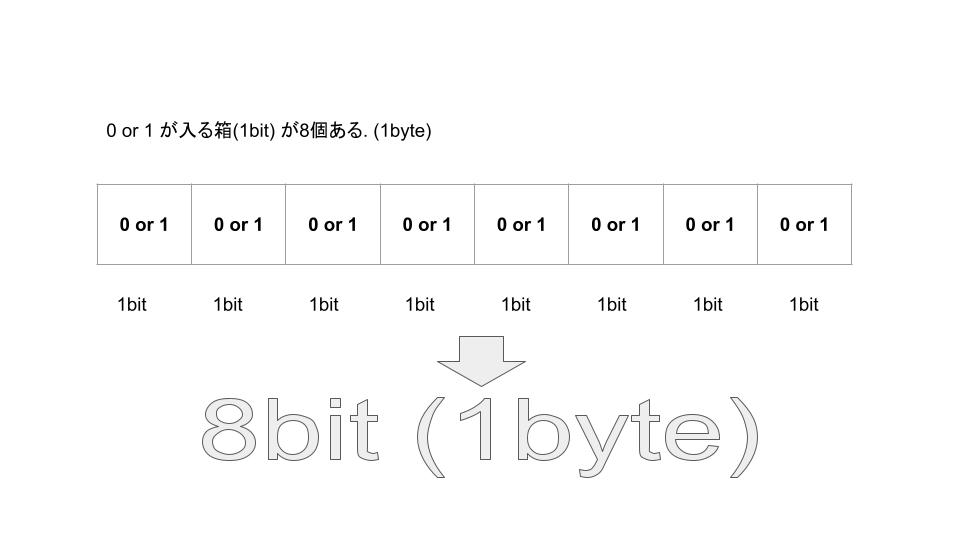

<!-- prerender: true -->
<!-- class: invert -->

# bit演算

---

## bitとは？

- binary digitの略語。

- 情報の基本単位である。二進数の1桁のこと。

- 0か1になるもので、コンピューターが処理する最小の単位のこと。
>実は、1, 0が電気信号のon offを表しています。

コンピューターは、無数の 0, 1の組み合わせによって様々な情報を処理できる様になっている。

---

## Byteとは？

(0 or 1) が 8個 (1 Byte)

0か1が格納できる箱(bit)が8個あるイメージ

---

## コンピューターが扱える数字は？

先ほど述べた様に 0, 1しかコンピューターはわかりません。。。
0, 1 意外にも数字を表すにはどうすればいいでしょう...2進数です！！！

## N進数とは
>N個の記号からなる数の表現
>数を表す時に利用する記号の数

普段私たちが日常で利用しているものは、0 ~ 9 の数字を利用して数を表す10進数を用いていますね。

コンピューターの世界では、

---

## 2進数、10進数、16進数対応表

|2進数|10進数|16進数|
|--|--|--|
|0000b|0|0x0|
|0001b|1|0x1|
|0010b|2|0x2|
|0011b|3|0x3|
|0100b|4|0x4|
|0101b|5|0x5|
|0110b|6|0x6|
|0111b|7|0x7|
|1000b|8|0x8|
|1001b|9|0x9|
|1010b|10|0xA|
|1011b|11|0xB|
|1100b|12|0xC|
|1101b|13|0xD|
|1110b|14|0xE|
|1111b|15|0xF|
|11110b|16|0x10|

...

