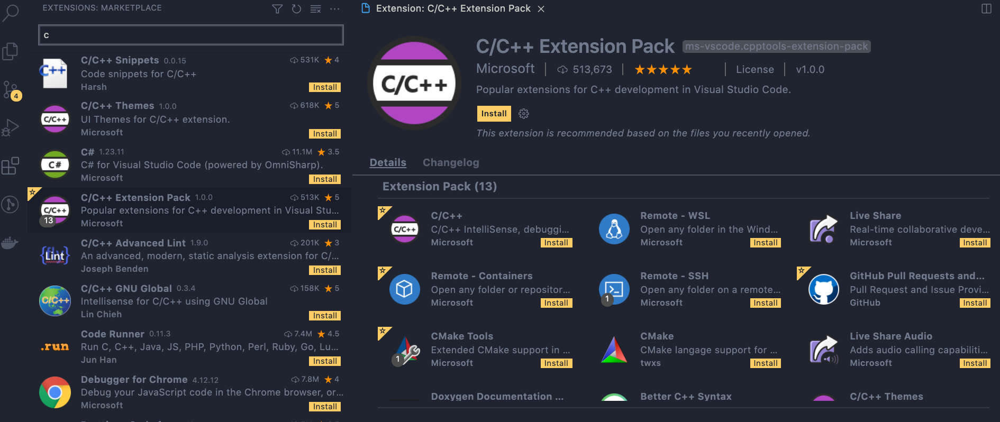
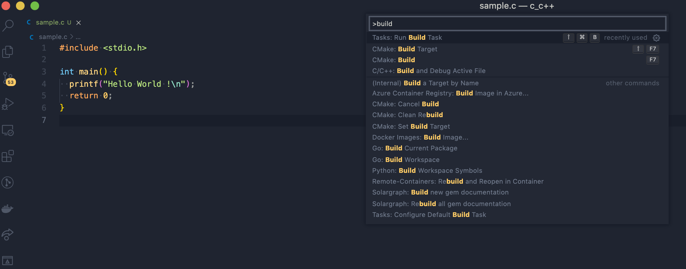
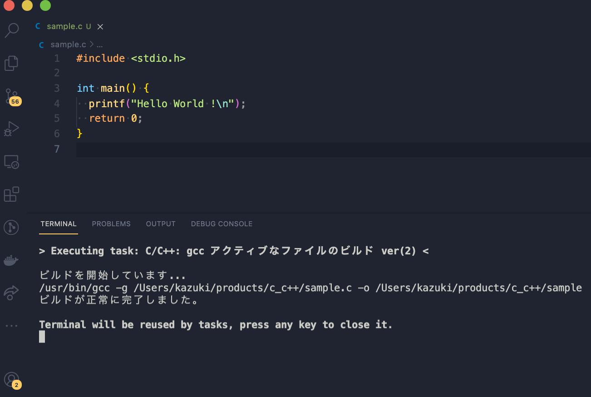
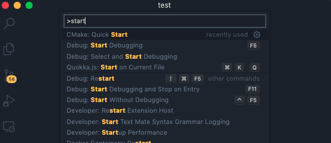
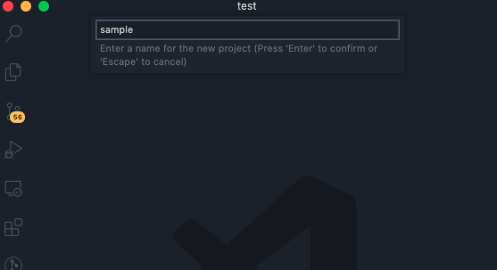
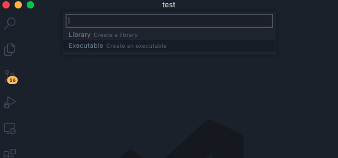
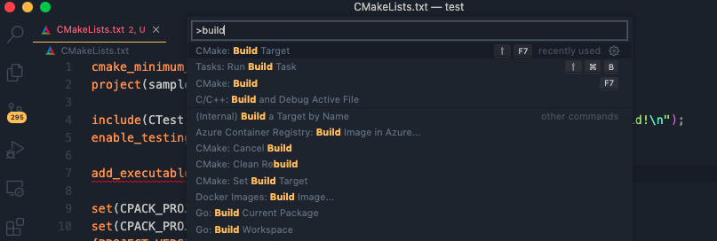
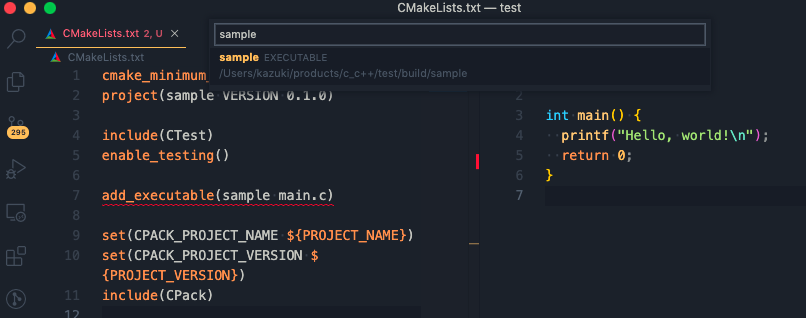

<!-- prerender: true -->
<!-- class: invert -->

# VScodeを利用したC言語の開発環境
>VScodeをインストールしている前提で話を進めます。

---

Extentionsから `C/C++ Extensio Pack` を検索して、便利な拡張機能を一括でインストールします。



---

ちなみにインストールするのは以下のextensionだけでもOKです。
- C/C++ for Visual Studio Code
- CMake Tools
- CMake

---

## 実際にコードをコンパイルする

command shift p で コマンドパレットを開いて `build` と入力すると `Tasks: Run Build Task` が出てくるので実行します。 (Windowsだと ctrl shift p になるかと思います。)



---



---

以下の例では `sample.c` というファイルをコンパイル後 `sampele` というファイルが出力されていますのでそのファイルを実行します。

```
❯ ls
sample.c   sample

❯ ./sample
Hello World !
```

ちなみにコマンドでコンパイルしたい場合の例
> gcc がインストールされている場合

```
❯ gcc sample.c -o sammple

❯ ./sample
Hello World !
```

---

## CMakeを使ってコンパイルする

コンパイラの設定を自動化するためのC/C++用のツール。
`複数ファイルを一括でコンパイルしたい場合` や、チームで開発する時に各々がコンパイルの設定をしなくても済みます。

---

## CのコードをCMakeでコンパイルする

- コマンドパレットから `CMake: Quick Start` を選択。



---

- projetct名を決める



---

- Executableを選択


---

そうすると `CMakeLists.txt` というファイルが生成されます。

- main.cpp を main.c に変更して
>cppはC++の拡張子で、
>今回書くのはC言語なので拡張子はcにしておきます。

```txt
cmake_minimum_required(VERSION 3.0.0)
project(sample VERSION 0.1.0)

include(CTest)
enable_testing()

add_executable(sample main.cpp)
# add_executable(sample main.c) に変える。

set(CPACK_PROJECT_NAME ${PROJECT_NAME})
set(CPACK_PROJECT_VERSION ${PROJECT_VERSION})
include(CPack)
```

---

- main.c のファイル内容を以下のように書き換えます。

```c
#include <stdio.h>

int main() {
  printf("Hello, world!\n");
  return 0;
}
```

---

- コードをビルドする
>コマンドパレットから `CMake: Build Target` を入力し実行





---

buildディレクトリ内にコンパイル済ファイルがあるので、実行します。

```
❯ ls
build  CMakeLists.txt  main.c

❯ ./build/sample
Hello, world!
```

sampleというファイルを確認するとちゃんとありますね。
```
❯ cd build

❯ ls
cmake_install.cmake  compile_commands.json    CTestTestfile.cmake    sample
CMakeCache.txt       CPackConfig.cmake        DartConfiguration.tcl  Testing
CMakeFiles           CPackSourceConfig.cmake  Makefile
```

---