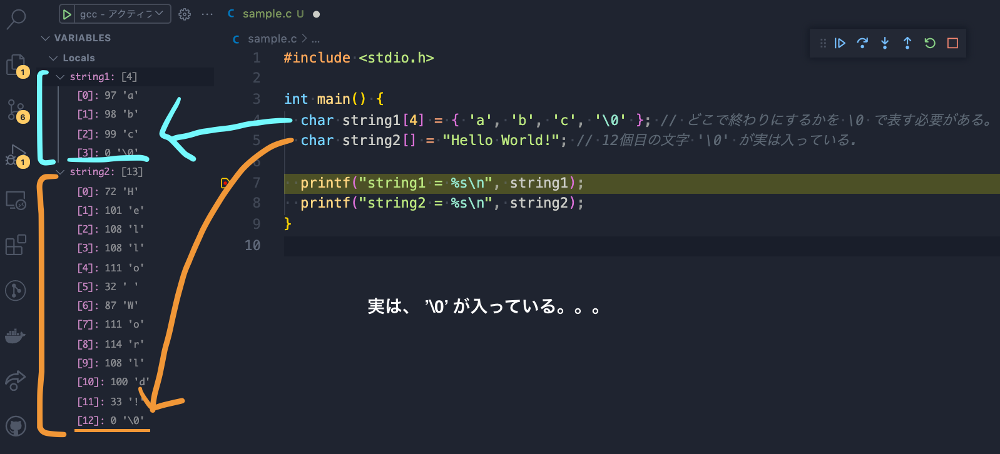

<!-- prerender: true -->

# C言語 入門
>他のプログラミング言語を何かしら触ったあることを前提とします

---

## C言語について

- C言語は様々な目的で利用するために作られた、1972年に開発されたプログラミング言語。
- 様々な言語のコンパイラとしてC言語が利用されていたりする。
- IoTなどの普及によりC言語やC++言語が再び注目を浴びている。
- 家電製品や自動車にも利用されている。

---

## 開発環境

- Mac
- [C言語 VScodeで環境構築]()

---

## とりあえずコードを実行

```c
// printf関数を利用するために最初に呼び出しておく header ファイル。
// 他にも色々なライブラリが標準で備わっている。
#include <stdio.h>

// main関数はプログラムのエントリポイント
// この中に処理を書いていく。
int main()
{
  printf("こんにちは。私の名前は%sです。 \n年齢は%d歳", "Cゲンガー", 23);
  return 0; // プログラム正常終了の合図
}

```

```
こんにちは。私の名前はCゲンガーです。
年齢は23歳です。
```
---

### printfについて補足

- 第一引数が出力される文字列
- 第二引数以降は何かしらの値

第一引数に記載されたformat specifier(フォーマット指定子)を元に第二引数の値が挿入される。

上記のコードでは
- 文字列型(string)である `%s` が `Cゲンガー` と一致する。
- 10進数の実数型(decimal)である `%d` が `23` と一致する。

---

## return 0; について

以下のような2つのコードがあるとして、コンパイル後にターミナルでコマンドを打ってみました。

```c
#include <stdio.h>
int main() {
  printf("Hello World ! ")
  return 0;
}
```

```
% ls
hello.c hello

% ./hello && echo "Hi !"
```

出力結果
```
Hello World ! Hi!
```

---

### return 1; にすると？

```c
#include <stdio.h>
int main() {
  printf("Hello World ! ")
  return 1;
}
```

```
% ls
hello.c hello

% ./hello && echo "Hi !"
```

出力結果
```
Hello World !
```

---

&& は `コマンド1 && コマンド2` のような時、
コマンド1が成功した時に、コマンド２を実行する。

- return 0; は正常終了を意味する。
- reutrn 0以外で以上終了となる。

ちなみにC99, 999年に策定されたC言語の規格以降では `return 0;` の記述が無くても動作します。

---

## 書式指定(一例)

|書式|説明|
|---|---|
|%d|整数値10進数|
|%f|実数値10進数(単精度実数)|
|%lf|実数値10進数 (倍精度実数)|
|%c|文字。ASCII(アスキー)コードで表示された文字を表示する。'' で囲う。|
|%s|文字列を表示する。ダブルクォーテーションを表示する。|

- %f, %lf について
それぞれ32bit, 64bitでデータを扱う。

---

## データ型(一例)

|データ型|意味|説明|サイズ|
|---|---|---|---|
|char|整数型（文字列）|1byteの符号付整数。ASCIIコードという文字コードに使用|8bit|
|int|整数型|2または4byteの整j数(コンパイラに依存する)|16bit|
|float|浮動小数点型|4byteの単精度浮動小数点実数|32bit|
|double|浮動小数点型|8byteの倍精度浮動小数点実数|64bit|

---

* 符号付整数型
>0と正負の数を表現できる整数型。
>先頭が値の正負を表す符号ビットがある。（0が正/1が負）

* 単精度浮動小数点実数
>有効桁数の少ない小数点を格納できる型

* 倍精度不動小数点実数
>有効桁数の多い小数点を格納できる型

---

## 変数

変数宣言する際には型を指定して、printfなどの関数実行後に変数定義はしない方が良くて、
変数は最初に全て定義しておかないといけない。

```c
#include <stdio.h>

int main()
{
  int a = 10;
  int b;
  b = 5; // 後から初期化もできる

  add = a + b;
  sub = a - b;
  printf("%d + %d = %d\n", a, b, add);
  printf("%d - %d = %d\n", a, b, sub);
}
```

```
10 + 5 = 15
10 - 5 = 5
```

---

## 配列(数値編)

```c
#include <stdio.h>

int main() {
  int d[5]; // size5の配列変数の宣言(配列の5番目という意味ではない!)
  int i;

  d[0] = 1;
  d[1] = 2;
  d[2] = 3;

  for (i = 0; i < 3; i++) {
    printf("%d ", d[i]);
  }
  printf("\n");
}
```

```
1 2 3
```

---

### 初期化(数値)

```c
#include <stdio.h>

int main() {
  int n[] = { 1, 2, 3, 4, 5 };
  int i;

  for(i = 0; i < 5; i++) {
    printf("n[%d] は %d\n", i, n[i]);
  }
}
```

```
n[0] は 1
n[1] は 2
n[2] は 3
n[3] は 4
n[4] は 5
```

---

## 配列(文字列編)

コードを実行する前に頭に入れておきたいこと。
>C言語では文字列とは文字の配列のこと !!!

どういうことか見ていきます🤔

```c
#include <stdio.h>

int main() {
  char string1[4] = { 'a', 'b', 'c', '\0' }; // どこで終わりにするかを '\0' で表す必要がある。
  char string2[] = "Hello World!"; // 12個目の文字 '\0' が実は入っている.

  printf("string1 = %s\n", string1);
  printf("string2 = %s\n", string2);
}
```

```
string1 = abc
string2 = Hello World!
```

文字の配列が文字列になっている🤔


---

```c
#include <stdio.h>

int main() {
  char string3[6]; // 最大10文字まで入る文字列(= 最後に'\0'が入るので9文字指定できる)
  int i;

  printf("6文字以内で文字を入力してください。\n");
  scanf("%s", string3);
  printf("s3 = %s\n", string3);
}
```
abcdeと入力してみる。
```
6文字以内で文字を入力してください。
abcde
s3 = abcde
```

---

## デバッグツールで '\0' を確認してみた

変数が初期化された後の行でbreak pointを指定。(赤丸のやつ)



実際にあった。

---

