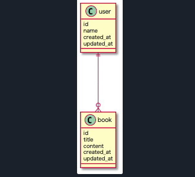

<!-- prerender: true -->

<style>
  section {
    font-size: 20px
  }
</style>

# Rails アソシエーションの設定方法とメリット
## 1:多の関係イメージ図



---

## アソシエーションの設定は大きく捉えて2つだけ
1. モデルに関係性を定義
>Userモデルにhas_many :books の設定を定義する
>Bookモデルにbelongs_to :user の設定を定義する

2. idレベルで紐付け
>「Nが」`相手のid`を `相手のモデル名_idに` 保持している
*主キー(id)と外部キー(user_id)の紐付け


---

## 設定方法は分かったけど...アソシエーションで嬉しいこととは？

その１: `userのインスタンス.books` で
  >紐づいたbookを全て取得できる

その２: `bookのインスタンス.user` で
  >紐づいたuserを一人取得できる

紐づくものを取得できるということですね。

---

# 実際に検証してみました！😲

---

## このようなデータベースのテーブルがあるとします

usersテーブル
|id|name|introduction|
|---|---|---|
|1|メンター太郎|Rubyが得意です|
|2|メンター二郎|HTML/CSSが得意です|
|3|ねずこ|鬼滅の主人公の妹です。。。|

booksテーブル
|id|title|body|user_id|
|---|---|---|---|
|1|Ruby on Railsデザインパターン|仕組みがよく分かった！|1|
|2|HTML/CSSデザインパターン|デザインパターンが増えた！|2|
|3|鬼滅の刃|面白かった！|3|
|4|星の王子様|大切なものとは何か考えさせられた。。。|1|

---

## rails cではこのように取得できます

```
> rails c

> User.all # データベースから全てのUserを取得

[#<user id: 1, name: 'メンター太郎', introduction: 'Rubyが得意です', ... >
#<user id: 2, name: 'メンター二郎', introduction: 'HTML/CSSが得意です', ... >
#<user id: 3, name: 'ねずこ', introduction: '鬼滅の主人公の妹です。。。', ... >]
```

```
> rails c

> Book.all # データベースから全てのBookを取得

[#<book id: 1, title: 'Ruby on Railsデザインパターン', body: '仕組みがよく分かった！', user_id: 1, ... >,
#<book id: 2, title: 'HTML/CSSデザインパターン', body: 'デザインパターンが増えた！', user_id: 2, ... >,
#<book id: 3, title: '鬼滅の刃', body: '面白かった！', user_id: 3, ... >,
#<book id: 4, title: '星の王子様', body: '大切なものとは何か考えさせられた。。。', user_id: 1, ... >]
```

---

## 実際に実験してみる
`rails console` で実験してみると...


```
❯ rails c

Running via Spring preloader in process 16083
Loading development environment (Rails 5.2.4.3)

[1] pry(main)> user_instance = User.find(1)
  User Load (0.5ms)  SELECT  "users".* FROM "users" WHERE "users"."id" = ? LIMIT ?  [["id", 1], ["LIMIT", 1]]
=> #<User id: 1, name: 'メンター太郎', introduction: 'Rubyが得意です', ... >

[2] pry(main)> user_instance.books
  Book Load (0.7ms)  SELECT "books".* FROM "books" WHERE "books"."user_id" = ?  [["user_id", 1]]
=> [#<Book id: 1, title: 'Ruby on Railsデザインパターン', body: '仕組みがよく分かった！', user_id: 1, ... >,
  #<Book id: 4, title: '星の王子様': '大切なものとは何か考えさせられた。。。', user_id: 1, ...> ]
```

`idが1のuser`から`user_idが1のbookを`2つ割り出せました。

---

# userからbookを取得でき、bookからuserを取得できる
## これを簡単にできるのがアソシエーションの大きなメリットではないでしょうか？😃

---

## 参考

- Active Record の基礎 - スキーマのルール
https://railsguides.jp/active_record_basics.html#%E3%82%B9%E3%82%AD%E3%83%BC%E3%83%9E%E3%81%AE%E3%83%AB%E3%83%BC%E3%83%AB

- Active Record の関連付け
https://railsguides.jp/association_basics.html
