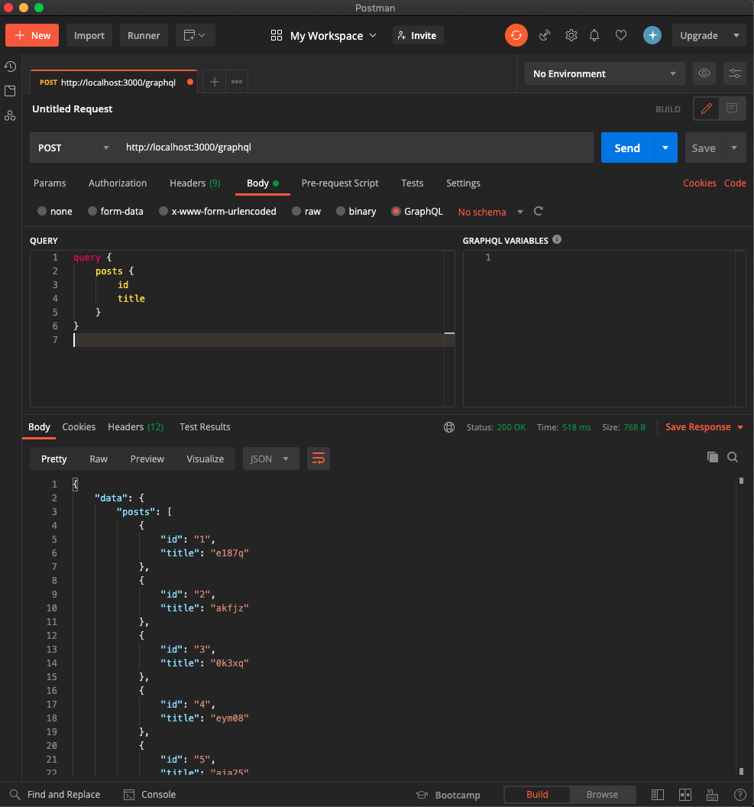

<!-- prerender: true -->
<!--
  theme: gaia
  class: lead
-->

# Rails API + GraphQL - 基本的 な CRUD編

---

# 前提

## 以下のモデル、対応するテーブルが存在すること
- `Post` (id: integer, title: string, body: string)

- `Comment` (id: integer, content: string)

```
$ rails g model Post title:string body:string; rails g model Comment content:string post:references; rails db:migrate
```

- Post:Commentが 1:Nの関係であること
> Post モデルに `has_many :comments, dependent: :destroy` を定義しましょう

---

# gem graphqlを追加

以下を追加
```
# Gemfile
gem 'graphql'
```

```
$ bundle install
```

---

# graphqlのテンプレートを生成

graphql-rubyのboilerplateを追加
```
$ rails g graphql:install
```

---

# object typeを宣言

> app/graphql/types/ 配下に作られます

```
$ rails g graphql:object Post; rails g graphql:object Comment
```

---

```ruby
# app/graphql/types/post_type.rb
module Types
  class PostType < Types::BaseObject
    field :id, ID, null: false
    field :title, String, null: true
    field :body, String, null: true
    field :created_at, GraphQL::Types::ISO8601DateTime, null: false
    field :updated_at, GraphQL::Types::ISO8601DateTime, null: false

    field :comments, [Types::CommentType], null: false, description: 'post has many comments'
  end
end

# app/graphql/types/comment_type.rb
module Types
  class CommentType < Types::BaseObject
    field :id, ID, null: false
    field :content, String, null: true
    field :post_id, Integer, null: false
    field :created_at, GraphQL::Types::ISO8601DateTime, null: false
    field :updated_at, GraphQL::Types::ISO8601DateTime, null: false

    field :post, PostType, null: false
  end
end

```

---

# Queryを定義

```ruby
module Types
  class QueryType < Types::BaseObject
    field :post, PostType, null: false do
      description 'find a post by id'
      argument :id, ID, required: true
    end

    field :posts, [PostType], null: true do
      description 'fetch all posts'
    end

    field :comment, CommentType, null: false do
      description 'find a comment by id'
      argument :id, ID, required: true
    end

    def post(id:)
      Post.find(id)
    end

    def posts
      Post.all.includes(:comments)
    end

    def comment(id:)
      Comment.find(id)
    end
  end
end
```

---

# fakerを利用してダミーデータを作成する

group :development, :test の中にfakerを書いてbundle install

```ruby
# Gemfile
gem 'faker'
```

```ruby
# db/seed.rb
10.times do
  post = Post.create!(title: Faker::Lorem.characters(number: 5), body: Faker::Lorem.characters(number: 10))
  10.times { post.comments.create!(content: Faker::Lorem.characters(number: 5)) }
end
```

実際にデータを作成する

```
$ rails db:seed
```

---

# GUIアプリでクエリを確認する
> POSTリクエストでエンドポイントは `http://localhost:3000/graphql`
> でGraphQLのクエリを書きます。

今回はPostmanで検証してみました

---



---

## 定義したQueryを利用してみる

---

- id 1 の post を検索

```js
query {
    post(id: 1) {
        title
    }
}
```

```js
{
    "data": {
        "post": {
            "title": "e187q"
        }
    }
}
```

---

- 全ての posts の title を検索

```js
query {
    posts {
        title
    }
}
```

---

```js
{
    "data": {
        "posts": [
            {
                "title": "e187q"
            },
            {
                "title": "akfjz"
            },
            {
                "title": "0k3xq"
            },
            {
                "title": "eym08"
            },
            {
                "title": "aja25"
            },
            {
                "title": "3bpjn"
            },
            {
                "title": "akjhs"
            },
            {
                "title": "ypydy"
            },
            {
                "title": "rwc1c"
            },
            {
                "title": "6cb08"
            }
        ]
    }
}
```

---

- id 1 の post に紐づく comment の id と content を全て取得

```js
query {
    post(id: 1) {
        comments {
            id
            content
        }
    }
}
```

---

```js
,{
    "data": {
        "post": {
            "comments": [
                {
                    "id": "1",
                    "content": "b9pi8"
                },
                {
                    "id": "2",
                    "content": "oacut"
                },
                {
                    "id": "3",
                    "content": "twsx1"
                },
                {
                    "id": "4",
                    "content": "mkx8p"
                },
                {
                    "id": "5",
                    "content": "r1qtg"
                },
                {
                    "id": "6",
                    "content": "4d802"
                },
                {
                    "id": "7",
                    "content": "3g9c8"
                },
                {
                    "id": "8",
                    "content": "jl27h"
                },
                {
                    "id": "9",
                    "content": "2k5uw"
                },
                {
                    "id": "10",
                    "content": "bbdua"
                }
            ]
        }
    }
}
```

---

# Mutation
>データを投稿する、更新、削除する

---

# データを作成する

---

# まず最初に...

*継承先 `GraphQL::Schema::RelayClassicMutation`から、
`::RelayClassicMutation`を削除しないとデーター投稿できませでした。

公式APIより引用
>This class is part of a private API. You should avoid using this class if possible, as it may be removed or be changed in the future.

```rb
module Mutations
  # class BaseMutation < GraphQL::Schema::RelayClassicMutation
  class BaseMutation < GraphQL::Schema::Mutation
    null false
  end
end
```

---

## Post作成します

```
$ rails g graphql:mutation create_post
```

---

```rb
# app/graphql/mutations/create_post.rb
module Mutation
  class CreatePost < BsseMutation
    argument :title, String, required: true
    argument :body, String, required: true

    type Types::PostType

    def resolve(title: nil, body: nil)
      Post.create!(description: description, body: body)
    end
  end
end
```

```rb
# app/graphql/types/mutation_type.rb
module Types
  class MutationType < Types::BaseObject
    field :create_post, mutation: Mutations::CreatePost
  end
end
```

---

## 実際にデータを作成

```js
mutation {
    createPost(
        title: "GraphQL",
        body: "A query language for your API"
    ) {
        id
        title
        body
    }
}
```

```js
{
    "data": {
        "createPost": {
            "id": "11",
            "title": "GraphQL",
            "body": "A query language for your API"
        }
    }
}
```

---

## Commentを作成します

```
$ rails g graphql:mutation create_comment
```

---

```rb
# app/graphql/mutations/create_comment.rb
module Mutations
  class CreateComment < BaseMutation
    argument :content, String, required: true
    argument :post_id, Integer, required: true

    type Types::CommentType

    def resolve(content: nil, post_id: nil)
      Comment.create!(content: content, post_id: post_id)
    end
  end
end
```

```rb
# app/graphql/types/mutation_type.rb
module Types
  class MutationType < BaseObject
    field :create_post, mutation: Mutations::CreatePost
    field :create_comment, mutation: Mutations::CreateComment
  end
end
```

---

## 実際にデータを作成

```js
mutation {
    createComment(
        content: "Rails API モードでGraphQLを勉強中",
        postId: 1
    ) {
        id
        content
        postId
    }
}
```

```js
{
    "data": {
        "createComment": {
            "id": "101",
            "content": "Rails API モードでGraphQLを勉強中",
            "postId": 1
        }
    }
}
```

---

# データを更新する

---

## Postを更新します

```
$ rails g graphql:mutation update_post
```

---

```rb
# app/graphql/mutations/update_post.rb
module Mutations
  class UpdatePost < BaseMutation
    argument :id, Integer, required: true
    argument :title, String, required: false
    argument :body, String, required: false

    type Types::PostType

    def resolve(id:, **attributes)
      Post.find(id).tap { |post| post.update!(attributes) }
    end
  end
end
```

>update!ではtrue or errorが戻り値となります。
>インスタンスをリターンしたいのでtapを利用しています。

---

```rb
module Types
  class MutationType < BaseObject
    field :create_post, mutation: Mutations::CreatePost
    field :create_comment, mutation: Mutations::CreateComment
    field :update_post, mutation: Mutations::UpdatePost
  end
end
```

---

以下のクエリで取得できたデータを更新してみます。

```js
query { post(id: 1) { title body} }
```

```js
{
    "data": {
        "post": {
            "title": "GraphQL",
            "body": "A query language for your API"
        }
    }
}
```

---

## 実際にデータを更新

```js
mutation {
    updatePost(
        id: 1
        title: "Rails API with GraphQL"
        body: "study mutation"
    ) {
        id
        title
        body
    }
}
```

```js
{
    "data": {
        "updatePost": {
            "id": "1",
            "title": "Rails API with GraphQL",
            "body": "study mutation"
        }
    }
}
```

---

## Commentを更新する

```
$ rails g graphql:mutation update_comment
```

---

```rb
# app/graphql/mutations/update_comment.rb
module Mutations
  class UpdateComment < BaseMutation
    argument :id, Integer, required: true
    argument :content, String, required: false

    type Types::CommentType

    def resolve(id:, **attributes)
      Comment.find(id).tap { |comment| comment.update!(attributes) }
    end
  end
end
```

---

```rb
module Types
  class MutationType < BaseObject
    field :create_post, mutation: Mutations::CreatePost
    field :update_post, mutation: Mutations::UpdatePost

    field :create_comment, mutation: Mutations::CreateComment
    field :update_comment, mutation: Mutations::UpdateComment
  end
end
```

---

以下のクエリで取得できたデータを更新してみます。

```js
query { comment(id: 101) { content } }
```

```js
{
    "data": {
        "comment": {
            "content": "Rails API モードでGraphQLを勉強中"
        }
    }
}
```

---

## 実際にデータを更新

```js
mutation {
    updateComment(id: 101 content: "please tell me how to update data by mutation") {
        id
        content
    }
}
```

```js
{
    "data": {
        "updateComment": {
            "id": "101",
            "content": "please tell me how to update data by mutation"
        }
    }
}
```

---

# データの削除する

---

## Postを削除します

---

## 実際にデータを削除

```js
mutation { destroyPost(id: 7) { title } }
```

```js
{
    "data": {
        "destroyPost": {
            "title": "ta05v"
        }
    }
}
```

---

モデルに `dependent: :destroy` の設定があるので、アソシエーションで紐づいている
comment10件も削除されました。

**terminal**

```rb
Started POST "/graphql" for ::1 at 2021-01-31 14:47:46 +0900
Processing by GraphqlController#execute as */*
  Parameters: {"query"=>"mutation {\n    destroyPost(id: 7) { title }\n}\n", "graphql"=>{"query"=>"mutation {\n    destroyPost(id: 7) { title }\n}\n"}}
  Post Load (0.3ms)  SELECT "posts".* FROM "posts" WHERE "posts"."id" = ? LIMIT ?  [["id", 7], ["LIMIT", 1]]
  ↳ app/graphql/mutations/destroy_post.rb:8:in `resolve'
   (0.1ms)  begin transaction
  ↳ app/graphql/mutations/destroy_post.rb:8:in `resolve'
  Comment Load (0.3ms)  SELECT "comments".* FROM "comments" WHERE "comments"."post_id" = ?  [["post_id", 7]]
  ↳ app/graphql/mutations/destroy_post.rb:8:in `resolve'
  Comment Destroy (41.2ms)  DELETE FROM "comments" WHERE "comments"."id" = ?  [["id", 61]]
  ↳ app/graphql/mutations/destroy_post.rb:8:in `resolve'
  Comment Destroy (0.2ms)  DELETE FROM "comments" WHERE "comments"."id" = ?  [["id", 62]]
  ↳ app/graphql/mutations/destroy_post.rb:8:in `resolve'
  Comment Destroy (0.1ms)  DELETE FROM "comments" WHERE "comments"."id" = ?  [["id", 63]]
  ↳ app/graphql/mutations/destroy_post.rb:8:in `resolve'
  Comment Destroy (0.1ms)  DELETE FROM "comments" WHERE "comments"."id" = ?  [["id", 64]]
  ↳ app/graphql/mutations/destroy_post.rb:8:in `resolve'
  Comment Destroy (0.2ms)  DELETE FROM "comments" WHERE "comments"."id" = ?  [["id", 65]]
  ↳ app/graphql/mutations/destroy_post.rb:8:in `resolve'
  Comment Destroy (0.1ms)  DELETE FROM "comments" WHERE "comments"."id" = ?  [["id", 66]]
  ↳ app/graphql/mutations/destroy_post.rb:8:in `resolve'
  Comment Destroy (0.1ms)  DELETE FROM "comments" WHERE "comments"."id" = ?  [["id", 67]]
  ↳ app/graphql/mutations/destroy_post.rb:8:in `resolve'
  Comment Destroy (0.1ms)  DELETE FROM "comments" WHERE "comments"."id" = ?  [["id", 68]]
  ↳ app/graphql/mutations/destroy_post.rb:8:in `resolve'
  Comment Destroy (0.1ms)  DELETE FROM "comments" WHERE "comments"."id" = ?  [["id", 69]]
  ↳ app/graphql/mutations/destroy_post.rb:8:in `resolve'
  Comment Destroy (0.1ms)  DELETE FROM "comments" WHERE "comments"."id" = ?  [["id", 70]]
  ↳ app/graphql/mutations/destroy_post.rb:8:in `resolve'
  Post Destroy (0.1ms)  DELETE FROM "posts" WHERE "posts"."id" = ?  [["id", 7]]
  ↳ app/graphql/mutations/destroy_post.rb:8:in `resolve'
   (0.7ms)  commit transaction
  ↳ app/graphql/mutations/destroy_post.rb:8:in `resolve'
Completed 200 OK in 174ms (Views: 0.2ms | ActiveRecord: 43.9ms | Allocations: 14865)
```

---

## Commentを削除します

---

## 実際にデータを削除

```js
mutation { destroyComment(id: 5) { title } }
```

```js
{
    "data": {
        "destroyComment": {
            "title": "f3lcz"
        }
    }
}
```

**terminal**

```ruby
Started POST "/graphql" for ::1 at 2021-01-31 14:51:44 +0900
Processing by GraphqlController#execute as */*
  Parameters: {"query"=>"mutation {\n    destroyComment(id: 79) { content }\n}\n", "graphql"=>{"query"=>"mutation {\n    destroyComment(id: 79) { content }\n}\n"}}
  Comment Load (0.2ms)  SELECT "comments".* FROM "comments" WHERE "comments"."id" = ? LIMIT ?  [["id", 79], ["LIMIT", 1]]
  ↳ app/graphql/mutations/destroy_comment.rb:8:in `resolve'
   (0.1ms)  begin transaction
  ↳ app/graphql/mutations/destroy_comment.rb:8:in `resolve'
  Comment Destroy (0.4ms)  DELETE FROM "comments" WHERE "comments"."id" = ?  [["id", 79]]
  ↳ app/graphql/mutations/destroy_comment.rb:8:in `resolve'
   (0.7ms)  commit transaction
  ↳ app/graphql/mutations/destroy_comment.rb:8:in `resolve'
Completed 200 OK in 22ms (Views: 0.3ms | ActiveRecord: 1.4ms | Allocations: 3386)
```

---

MutationでCRUD処理に当たる
CUDをできました！
