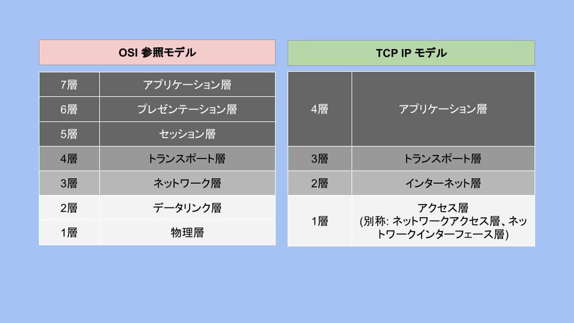

## ネットワークの基本
まず前提としてネットワークの基本には以下の概念がある。

>1. モデル: ネットワークにはデータのやりとりの仕組みを策定したもの
>2. プロトコル: モデルを構成する各階層に別れたレイヤ、各レイヤで動作するもの
>3. PDU: 各プロトコルで扱うデータ構造

## 色々なネットワークモデル
ISO(international organization for standardization)がベンダに依存しない形でシステムを接続するためにOSI(open system interconnection)という参照モデルを策定しました。
ただし実用面では普及しなかったため、別の組織が新しくTCP/IPモデルを考案しました。
なので実際にはTCP/IPモデルを目にすることが多いかと思います。



`TCP / IPモデル`
```
  1.アプリケーション層
      (HTTP FTP SMTP...)
      アプリケーションを示す番号やデータを組み立てルための情報を書き込みます。
  2.トランスポート層
      (TCP UDP)
      送受信するコンピュータのアドレスや宛先不明の時にデータを破棄する命令をする。
  3.インターネット層
      (IP)
      受信側にデータを届ける。
  4.アクセス層
      (Wi-Fi イーサネット ...)
```

## PDU
- 概要

ネットワーク上でのデータ送信はデータそのもの以外に、データを運ぶためのデータも必要になる。例えば、アドレスを特定したり、エラーチェックするものがあります。
それらをパケットに分けて送信します。

>データ量を一定の大きさに単位に分けて送信する(パケット通信)

またこれらのデータはプロトコル毎に決められるため、
PDU(Protocal Data Unit)と呼ばれる。

- PDUの基本構成
大きく分けて3つの項目から成る。

>1. header(ヘッダ): ペイロードを渡すためのデータ
>2. payload(ペイロード): (クライアントに渡したいデータ
>3. trailer(トレーラ): ペイロードを渡すためのデータ

アプリケーション層から物理側にいく毎にヘッダとトレーラはペイロードと合わせて一括りにされる。(encapsulation カプセル化)
物理層からアプリケーション層にいくごとにヘッダとトレーラーは外されていく。(decapsulation デカプセル化)
プロトコルによってトレーラは利用しないこともある。


