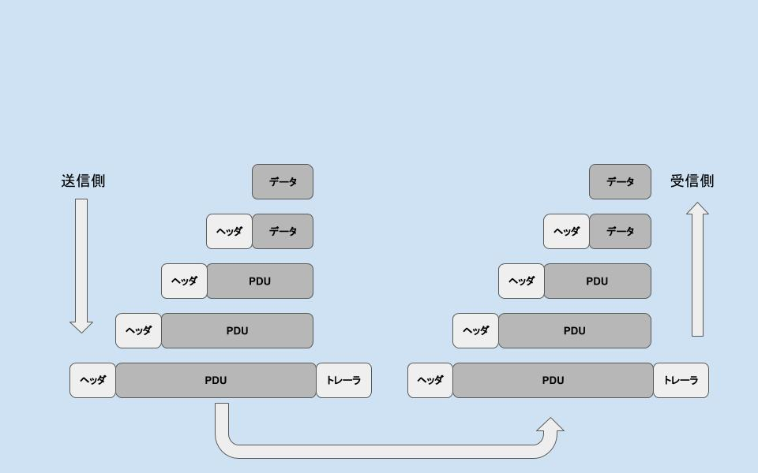

## ネットワークの基本
まず前提としてネットワークの基本には以下の概念がある。

>1. モデル: ネットワークにはデータのやりとりの仕組みを策定したもの
>2. プロトコル: モデルを構成する各階層に別れたレイヤ、各レイヤで動作するもの
>3. PDU: 各プロトコルで扱うデータ構造

## 規模に応じた、色々な(コンピューターの)ネットワーク
- LAN (local area network)
> 自宅、企業や施設内など、比較的狭い空間にある機器同士をつなぐネットワーク
- WAN (wide area network)
>地理的に離れた場所にある機器同士を繋いだ比較的大規模なネットワーク
- インターネット(internet)
>複数のLANやWANを繋いだ世界規模のネットワーク

## 通信のルール
複数のLANを繋げるにはコンピューター間でデータのやりとりを統一する必要がある。
通信の一連の流れを統一した手続きに基づいて行うTCP / IPという仕組みが誕生した。

## ちなみにIP/TCPによって実現した通信サービスの例が以下
- www
- 電子メール
- ファイル共有、転送
- 遠隔操作
- IP電話

## 色々なネットワークモデル
ISO(international organization for standardization)がベンダに依存しない形でシステムを接続するためにOSI(open system interconnection)という参照モデルを策定しました。
ただし実用面では普及しなかったため、別の組織が新しくTCP/IPモデルを考案しました。
なので実際にはTCP/IPモデルを目にすることが多いかと思います。


`TCP / IPモデル`

```
  1.アプリケーション層
      (HTTP FTP SMTP...)
      アプリケーションを示す番号やデータを組み立てルための情報を書き込みます。
  2.トランスポート層
      (TCP UDP)
      送受信するコンピュータのアドレスや宛先不明の時にデータを破棄する命令をする。
  3.インターネット層
      (IP)
      受信側にデータを届ける。
  4.アクセス層
      (Wi-Fi イーサネット ...)
```

## PDUの概要

ネットワーク上でのデータ送信はデータそのもの以外に、データを運ぶためのデータも必要になる。例えば、アドレスを特定したり、エラーチェックするものがあります。
それらをパケットに分けて送信します。

>データ量を一定の大きさに単位に分けて送信する(パケット通信)

またこれらのデータはプロトコル毎に決められるため、
PDU(Protocal Data Unit)と呼ばれる。

- PDUの基本構成
大きく分けて3つの項目から成る。

>1. header(ヘッダ): ペイロードを渡すためのデータ
>2. payload(ペイロード): (クライアントに渡したいデータ
>3. trailer(トレーラ): ペイロードを渡すためのデータ

アプリケーション層から物理側にいく毎にヘッダとトレーラはペイロードと合わせて一括りにされる。(encapsulation カプセル化)
物理層からアプリケーション層にいくごとにヘッダとトレーラーは外されていく。(decapsulation デカプセル化)
プロトコルによってトレーラは利用しないこともある。


