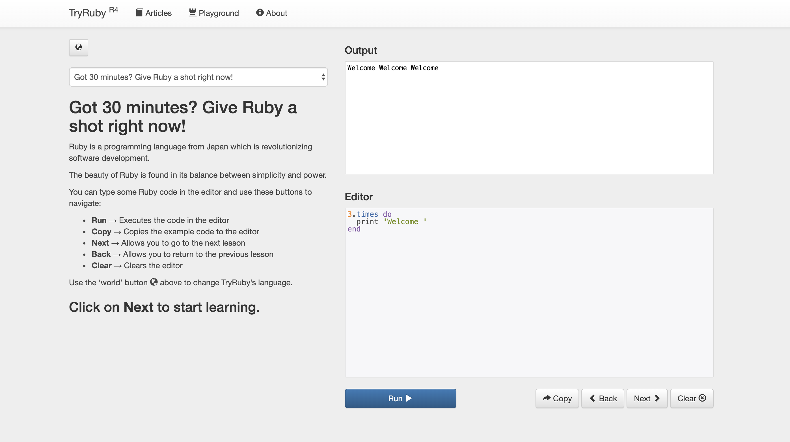

# 第1回 プログラミング言語 Ruby 入門

## Rubyとは?
Rubyは日本人のまつもとゆきひろ(通称Matz)さんが生み出したオブジェクト指向なプログラミング言語であり、世界でも広く利用されています。
Matzは以下のようにRubyについて語っています。
>>Rubyの外観はシンプルです。けれど、内側はとても複雑なのです。 それはちょうど私たちの身体と同じようなものです。

また、プログラミングを楽しんでもらいたいということも語っており、シンプルであるからこそ多くのプログラミング未経験者が無料でRubyを学んで様々なアプリを公開しています。
実際、Twitter、クックパッド、Gunosy、食べログなどもRubyを用いて作られたんです！
Rubyは初心者でも始めやすい言語ではあるのでさっそく実際にRubyでプログラミングを始めてみましょう！

## プログラミングを体験してみよう
[Ruby公式サイト](https://www.ruby-lang.org/ja/)の[試してみる!(ブラウザから)](https://try.ruby-lang.org/)のページでプログラムを実行することができます。
EditorにRubyのプログラムを書いてRunボタンを押して実行すると、Outputに実行結果が表示されます。



Editorではデフォルトで以下のようにコードがあります。
`do ... end` 内の処理を３回行うということが簡単にわかると思います。

```ruby
3.times do
 print "welcome"
end
```

Editorを以下のように書き換えて実行してみましょう。
すると出力に `Hello World` と表示されるはずです。
```ruby
print 'Hello World'
```

別のプログラミング言語 C で Hello World を表示させようとすると以下のように記述しなければいけません。
```c
#include <stdio.h>

int
main()
{
  printf("Hello World\n");
  return 0;
}
```

明らかにコード量に差が見られるのを確認できますね !

Rubyは少ない記述かつ、人間が直感的にコードを理解しやすいためストレスなくプログラミングを楽しめたり、習得しやすいことを理解してもらえたと思います !


## 環境構築をして自分のPCでRubyを実行しよう!
先ほどまでは、[Ruby公式サイト](https://www.ruby-lang.org/ja/)の[試してみる!(ブラウザから)](https://try.ruby-lang.org/)のページで実行していました。
しかし、ブラウザでは複雑なプログラムを実行するのには向いておりません。

今後、複雑なプログラムを実行するためにご自身のPCでRubyのプログラムを実行する方法について、丁寧に解説されている記事をご紹介しますので、実際に試してみてください。

[Mac向け Progateさんの記事](https://prog-8.com/docs/ruby-env)

[windows向け Progateさんの記事](https://prog-8.com/docs/ruby-env-win)

## 余談 Ruby or C言語
C言語はゲームや家電製品、や機械の制御装置などに利用されたりしています。
対してRubyはRuby on Rails というwebアプリケーションフレームワークと共に用いられる事が多いです。先ほど述べたようなwebサービスの例ではRuby on Railsが利用されています。

次回はRubyの基本的なコンセプトから学んでいきます !
